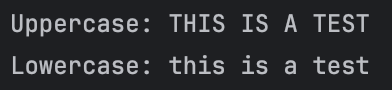
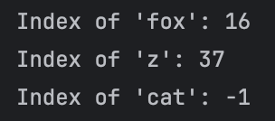
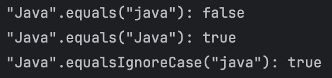
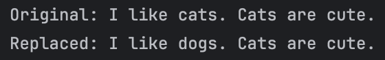
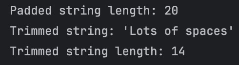

# FECP5-1009: Java Certification Preparation

## Hands-on Lab: Exploring Java String Methods
## Eric Conrad Panga
## Screenshots of Output

Exercise 1:

 

Exercise 2:

 

Exercise 3:

 

Exercise 4:

 

Exercise 5:

 

Exercise 6:

 

Exercise 7:

 

Exercise 8:

